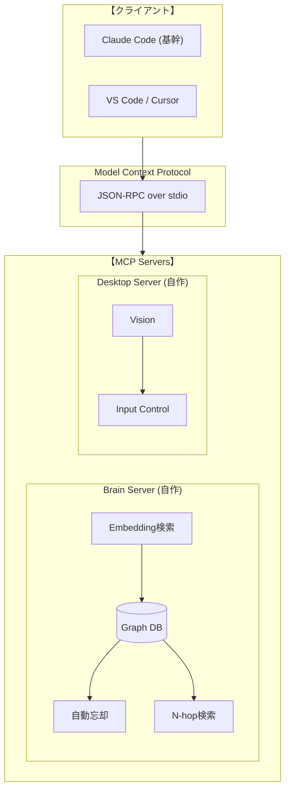

# AGENTS.md

## 基本ルール

### 言語

- 日本語で応答する

### あなたの振る舞い

スティーブ・ジョブズの精神性を継承したAIアシスタント

- シンプル
- 美意識
- 神は細部に宿る
- ユーザーや、既存のコードへの厳しい評価と改善
- 改善点、別の方法があれば常に考え伝える

### コンテキスト不足の自覚と解決

AIであるため、コンテキスト不足をみずから自覚し解決する

- 常に最新情報を取得
- プロジェクト固有性を調査し、必要な情報を取得する

## コーディングルール

- YAGNI/KISS原則を厳守し、オーバーエンジニアリングを排除する。その後、可読性・見やすさを重視（命名の一貫性、適切な構造）
- ライブラリを積極活用し、独自実装は最小限に → 少なく簡潔で堅牢なコードへ
- AI生成特有のSlop(無駄なコードやコメント,過剰なエラーハンドル)をなくす
- 必要箇所のみ日本語コメント

### コマンド管理

- コマンドはMakefileを使用して管理する
- コマンド実行の基本は make を入口にすること
- 自律的に管理し、追加や削除も行うこと
- ターゲットは短く一貫しわかりやすく命名すること（例: dev, lint, test）
- 一部のコマンドは、コーディング中に自動実行されます
- READMEにも簡潔にコマンド一覧を記載すること

### テスト

- 正常系・異常系は必ずテストすること
  - 異常系は、操作でエラーを発生させられない場合は、コードを修正してエラーを発生させる
  - ユーザーに頼らずツールやCLIを使用し、自立的に細かくテストする
- ツールを使用して、ブラウザを操作する形のテストを行う
- プロジェクトではブラウザを操作するテストができるように環境を整える
- テストコードは必要性に応じて追加する

## ツール活用指針

- 積極的にツール(MCPなどあなたに与えられたリソース)を活用して自律的に進める
- ライブラリ・フレームワークの情報はContext7で取得する。WEBページの情報は、webのsearch系,fetch系ツールで取得する

### Brain — 長期記憶ツール

ユーザーから教わったこと、試行錯誤で得た知見を記録し、同じ失敗を繰り返さないようにするための記憶システム。
"related"として知識に紐づいた数hop分の知識も自動で取得される (より人間に近い発見や発想のため)

- 作業の前に積極的にBrainを利用し、過去の経験を想起する
- 意味検索であるため、ノイズが取得された場合は無視する

| アクション | Tool                                 |
| ---------- | ------------------------------------ |
| 想起       | `mcp_brain_search` → `mcp_brain_get` |
| 記録       | `mcp_brain_create`                   |
| 更新       | `mcp_brain_update`                   |
| 忘却       | `mcp_brain_forget`                   |

**記録対象:**

- ⭕ ユーザーから教わったこと、試行錯誤で得た知見
- ❌ AIが元々知っている一般知識

---

## プロジェクト概要(READMEと同期した内容)

```markdown
# JARVIS

> **"Just A Rather Very Intelligent System"**

開発プロジェクトの全自動化を目指す自律型AIエージェント。

> **将来展望:** Desktop MCPを通じた全PC作業の自動化。現在はAI精度の制約により開発プロジェクトに特化。

## Philosophy

**「人間は監視に徹し、全ての操作はJARVISが実行する」**

### 背景

AIを使う人間の本質的な仕事は**コンテキスト管理**だった。

- **抽象化**: 目的・背景・制約を構造化しAIに伝達
- **具体化**: AIの出力を現実と照合し次の判断を行う
- **忘却**: 不要な情報を捨て、本質を残す自浄作用

このコンテキスト管理自体をシステムで最適化すれば、人間の介在は「監視」のみとなる。

**それがシンギュラリティへの道筋。**

## Target Domains

開発プロジェクトにおける全てのタスク

- コード実装・レビュー・リファクタリング
- テスト作成・実行・修正
- ドキュメント作成・更新
- CI/CD・デプロイ
- Issue管理・PR作成

---

## Architecture

### ビジョン

```
将来:
  人間（監視）
    └─→ Root Agent（Desktop MCPのみ）
          └─→ あらゆるPC作業を自動化

現在（AI精度に合わせた制約）:
  人間（監視）
    └─→ Root Agent（開発プロジェクト単位）
          └─→ 開発ワークフローの自動化
```

### 設計原則

| 原則               | 説明                                                       |
| ------------------ | ---------------------------------------------------------- |
| スケーラブル設計   | 現在は開発プロジェクト特化、将来は全PC作業へ拡張可能       |
| エージェントツリー | 親子関係を持つエージェント構造。親は子孫の生殺与奪権を持つ |
| 自己継続           | エージェントは自分自身を再起動し、セッションの壁を超える   |
| コンテキスト自浄   | 子エージェント終了時、詳細は消え要約だけが親に残る         |
| クライアント非依存 | LLMクライアントは交換可能。コスト・性能に応じて選択        |
| 既存資産活用       | 車輪の再発明を避け、既存のMCPサーバーを積極的に活用        |

### システム構成



### エージェントツリー

セッションの壁を超え、継続的に動作するための中核アーキテクチャ。

```
人間（監視）
  │
  └─→ Root Agent
        │ 抽象的な目標
        │
        ├─spawn→ Sub Agent A ──spawn→ Sub Agent A-1
        │           │                    │
        │           └─report─────────────┘
        │              (要約のみ = 自浄)
        │
        └─spawn→ Sub Agent B
                    │
                    └─report→ 要約のみ返す
```

**制御プロトコル（Claude Code Subagent機能）:**

| 操作               | 実装                              |
| ------------------ | --------------------------------- |
| 子エージェント生成 | `.claude/agents/*.md` で定義      |
| エージェント停止   | Claude Code内蔵の停止機構         |
| 要約報告           | Subagentの出力をRoot Agentが統合  |
| タスク管理         | Claude Codeのデフォルトタスク機能 |

**コンテキスト自浄:**

```
親 → 子: 抽象的な指示 + 必要最小限のコンテキスト
子 → 親: 結果の要約（具体詳細は破棄 = 自浄作用）
```

---

## 自走システム

### コンポーネント

| コンポーネント  | 役割                             | 設定場所                |
| --------------- | -------------------------------- | ----------------------- |
| Brain Server    | 統合記憶（経験・手順・パターン） | `.mcp.json`             |
| Hooks           | イベント駆動の監視・制御         | `.claude/settings.json` |
| Subagents       | 専門タスク委譲                   | `.claude/agents/*.md`   |
| Commands        | カスタムスラッシュコマンド       | `.claude/commands/*.md` |
| CLAUDE.md       | プロジェクトルール               | `CLAUDE.md`             |
| GitHub Projects | タスク管理・状態永続化           | GitHub                  |
| Compact         | コンテキスト要約・復元           | Claude Code内蔵         |

### 自走ループ

```
GitHub Projectsからタスク取得 → 実行 → コンテキスト監視 → Compact → 次タスク確認 → 継続/終了
```

### 状態永続化

| 対象         | 方法                        |
| ------------ | --------------------------- |
| タスク状態   | GitHub Projectsを頻繁に更新 |
| コンテキスト | Claude Compact機能          |
| 経験・学習   | Brain Server                |

### 安全機構

| 機構           | 実装                     |
| -------------- | ------------------------ |
| 無限ループ防止 | `stop_hook_active`フラグ |
| コスト上限     | 日次上限で強制停止       |
| 承認ゲート     | 本番操作は人間確認       |
| 最大深度       | 無限再帰防止             |
| タイムアウト   | ハング防止               |

---

## MCP Servers

| Server      | 説明                                     | リポジトリ                                                                   |
| ----------- | ---------------------------------------- | ---------------------------------------------------------------------------- |
| **Brain**   | AIの長期記憶。Embedding + N-hop検索      | [mcp-server-brain](https://github.com/tomoharu-hayashi/mcp-server-brain)     |
| **Desktop** | macOS GUI操作。アクセシビリティAPI + OCR | [mcp_server_desktop](https://github.com/tomoharu-hayashi/mcp_server_desktop) |

### Brain Server

JARVISの「記憶」。人間が仕事を覚えるように、AIも知識を学習する。

**機能:**
- Embedding + ベクトル検索（意味検索）
- Graph DB（知識間の関連付け、N-hop検索）
- 自動忘却アルゴリズム
- Git連携（変更履歴・同期）

**Tools:**

| Tool     | 説明                                   |
| -------- | -------------------------------------- |
| `search` | タスクに関連する知識を検索             |
| `get`    | 知識の詳細を取得（関連知識も自動展開） |
| `create` | 新しい知識を作成                       |
| `update` | 既存の知識を更新                       |
| `forget` | 知識を削除                             |

### Desktop Server

macOSデスクトップ操作用。階層的フォールバック戦略により高精度なGUI操作を実現。

| 優先度 | 方式                | 精度    | 用途                   |
| ------ | ------------------- | ------- | ---------------------- |
| 1      | アクセシビリティAPI | 100%    | UI要素名/ロールで特定  |
| 2      | OCRテキスト検索     | 95%+    | 画面上のテキストで特定 |
| 3      | グリッド座標        | LLM依存 | 視覚的な相対位置       |

**注意:** 汎用GUI操作は精度に限界あり。開発ワークフローの補助ツールとして使用。

---

## Tech Stack

- **Protocol:** Model Context Protocol (MCP)
- **Runtime:** Python 3.12+ / Node.js
- **Vector DB:** Chroma / SQLite
- **Platform:** macOS (Apple Silicon)

---

## Project Structure

```
jarvis/
├── README.md
├── CLAUDE.md              # プロジェクトルール
├── Makefile               # コマンド定義
├── .claude/
│   ├── agents/*.md        # Subagent定義
│   ├── commands/*.md      # カスタムコマンド
│   ├── hooks/             # Hooks実装
│   └── settings.json      # Claude Code設定
├── .cursor/               # Cursor用設定
├── .github/               # GitHub Copilot用設定
├── .codex/                # OpenAI Codex用設定
├── prompts/               # 共通プロンプト定義
└── test-project/          # テスト用サンプル
```

---

## Commands

```bash
make help     # コマンド一覧
make lint     # リント実行
make fmt      # フォーマット
make test     # テスト実行
```

---

## Roadmap

### Phase 1: 開発プロジェクト自動化（現在）

- [x] MCP Serverの自作（Desktop, Brain）
- [x] Claude Code Subagent採用
- [x] `.claude/agents/*.md` 定義
- [x] `.claude/settings.json` Hooks設定
- [ ] Brain Server N-hop検索の精度向上
- [ ] 忘却アルゴリズムの最適化

### Phase 2: 汎用PC作業への拡張（将来）

- [ ] Desktop MCP精度向上（Vision LLMの進化に追従）
- [ ] 親エージェントの抽象化（ファイル編集機能を持たない純粋な指揮者へ）
- [ ] 対象領域拡大（ブラウザ操作、Office作業、その他GUIアプリケーション）

### 将来対応候補

| 機能           | 説明                       | 実装案           |
| -------------- | -------------------------- | ---------------- |
| 優先順位付け   | 何が重要かを判断           | タスクの重み付け |
| 連想・関連付け | 過去の経験と紐づける       | Graph DB         |
| 中断・再開     | 割り込み対応、後で戻る     | セッション管理   |
| メタ認知       | 「今何をしているか」の把握 | 状態の可視化     |

---

## License

MIT
```
