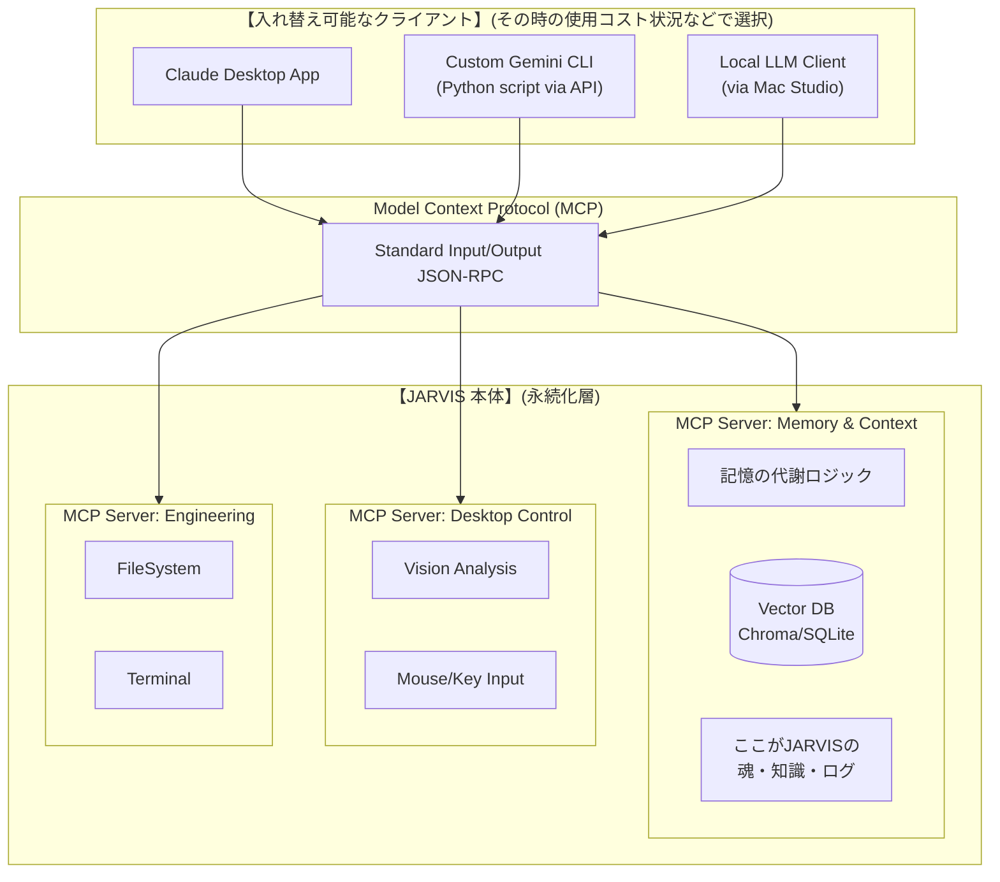

# Project JARVIS 概要定義書

## 1. ビジョンと基本コンセプト

**「人間はコンテキスト（文脈）の支配に徹し、実行はAIが担う」**

従来の「人間が作業し、AIが補助する」関係を逆転させます。ユーザーはプロジェクトの目標、背景、制約条件（コンテキスト）の管理に集中し、実際のPC操作や実作業は自律型AIエージェント「JARVIS」が実行します。

## 2. ターゲット領域

システムは主に以下の2つの業務領域をカバーします。

- **エンジニアリング:** コーディング、環境構築、テスト、Git管理、デプロイ。
- **動画制作・クリエイティブ:** 素材収集、動画編集ソフト（DaVinci Resolve等）の操作、レンダリング。

