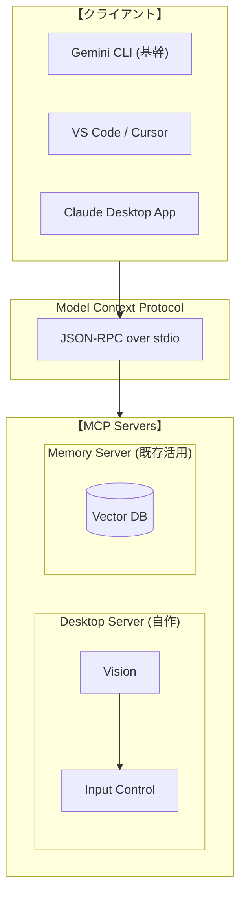

# JARVIS

> **"Just A Rather Very Intelligent System"**

自律型AIエージェント。人間はコンテキストの管理に徹し、実行はAIが担う。

## Philosophy

**「人間はコンテキスト（文脈）の支配に徹し、実行はAIが担う」**

従来の「人間が作業し、AIが補助する」関係を逆転。ユーザーはプロジェクトの目標・背景・制約条件の管理に集中し、実作業は JARVIS が実行する。

## Target Domains

| 領域 | 対象業務 |
|------|----------|
| **Engineering** | コーディング、環境構築、テスト、Git管理、デプロイ |
| **Creative** | 素材収集、動画編集（DaVinci Resolve等）、レンダリング |

## Architecture



> **設計思想:** Desktop操作が基本。ターミナルもエディタもGUIとして操作する。
> **基幹システム:** Gemini CLI - 無料枠（60req/分、1000req/日）で高性能な1Mトークンコンテキスト

## Tech Stack

- **Protocol:** Model Context Protocol (MCP)
- **Runtime:** Python 3.12+ / Node.js
- **Vector DB:** Chroma / SQLite
- **Platform:** macOS (Apple Silicon)

## MCP Servers

| Server | 状態 | リポジトリ |
|--------|------|------------|
| **Desktop** | 自作 | [mcp-desktop-server](https://github.com/tomoharu-hayashi/mcp-desktop-server) |
| **Memory** | 既存活用予定 | TBD |

## Project Structure

```
jarvis/
├── README.md
├── docs/
│   └── architecture.md
└── .github/
    └── instructions/       # AI向け指示書
```

## Getting Started

```bash
# 1. Clone
git clone https://github.com/tomoharu-hayashi/jarvis.git
cd jarvis

# 2. Setup (TBD)
```

## License

MIT
