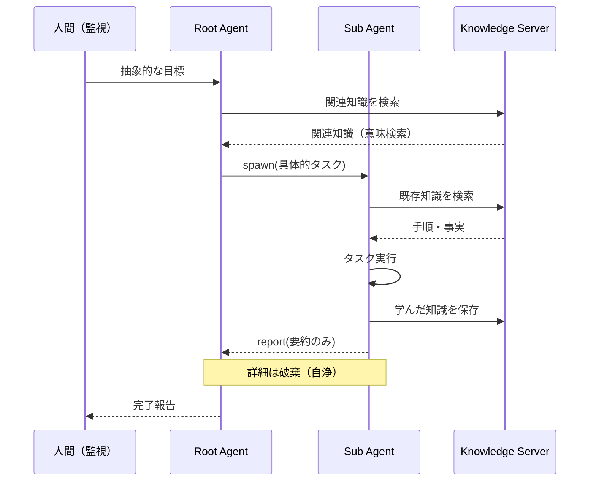

# JARVIS Architecture

## ビジョン

**最終目標:** Desktop MCPを通じた、ファイル編集機能を持たない親エージェントからの全PC作業の自動化

```
将来:
  人間（監視）
    └─→ Root Agent（Desktop MCPのみ）
          └─→ あらゆるPC作業を自動化

現在（AI精度に合わせた制約）:
  人間（監視）
    └─→ Root Agent（開発プロジェクト単位）
          └─→ 開発ワークフローの自動化
```

現状のAI精度では汎用GUI操作の信頼性に限界があるため、スコープを「開発プロジェクト」に絞っている。これは技術的制約による一時的な措置であり、アーキテクチャ自体は上位互換を維持。

## 設計原則

1. **スケーラブル設計:** 現在は開発プロジェクト特化、将来は全PC作業へ拡張可能
2. **エージェントツリー:** 親子関係を持つエージェント構造。親は子孫の生殺与奪権を持つ
3. **自己継続:** エージェントは自分自身を再起動し、セッションの壁を超える
4. **コンテキスト自浄:** 子エージェント終了時、詳細は消え要約だけが親に残る
5. **クライアント非依存:** LLMクライアントは交換可能。コスト・性能に応じて選択
6. **既存資産活用:** 車輪の再発明を避け、既存のMCPサーバーを積極的に活用

## システム構成

```
┌─────────────────────────────────────────────────────────┐
│                    LLM Clients                          │
│  ┌─────────────┐ ┌─────────────┐ ┌─────────────┐       │
│  │   Claude    │ │  VS Code /  │ │   Gemini    │       │
│  │   Desktop   │ │   Cursor    │ │    CLI      │       │
│  └──────┬──────┘ └──────┬──────┘ └──────┬──────┘       │
└─────────┼───────────────┼───────────────┼───────────────┘
          │               │               │
          └───────────────┼───────────────┘
                          │
              ┌───────────▼───────────┐
              │   MCP (JSON-RPC)      │
              │   stdio transport     │
              └───────────┬───────────┘
                          │
┌─────────────────────────┼─────────────────────────────┐
│                   MCP Servers                          │
│  ┌──────────────────────┼──────────────────────────┐  │
│  │    ┌───────────┐ ┌───┴───┐                      │  │
│  │    │ Knowledge │ │Desktop│                      │  │
│  │    │   (自作)  │ │ (自作)│                      │  │
│  │    └─────┬─────┘ └───┬───┘                      │  │
│  │          │           │                          │  │
│  │    ┌─────▼─────┐ ┌───▼─────┐                    │  │
│  │    │ Embedding │ │  macOS  │                    │  │
│  │    │ + GraphDB │ │Automation│                    │  │
│  │    └───────────┘ └─────────┘                    │  │
│  └─────────────────────────────────────────────────┘  │
└────────────────────────────────────────────────────────┘
```

## エージェントツリー

セッションの壁を超え、継続的に動作するための中核アーキテクチャ。

```
人間（監視）
  │
  └─→ Root Agent
        │ 抽象的な目標
        │
        ├─spawn→ Sub Agent A ──spawn→ Sub Agent A-1
        │           │                    │
        │           └─report─────────────┘
        │              (要約のみ = 自浄)
        │
        └─spawn→ Sub Agent B
                    │
                    └─report→ 要約のみ返す
```

### 制御プロトコル

| 操作 | 説明 |
|------|------|
| `spawn(goal, context)` | 子エージェント生成 |
| `kill(agent_id)` | 指定エージェント+全子孫を停止 |
| `report(summary)` | 親に要約を報告して自己終了 |
| `continue()` | 自己を再起動（セッション継続） |

### 自己継続プロトコル

```
セッションA終了時:
  → state.json に状態保存
  → pending_tasks.json に未完了タスク追加
  → 次のセッションをトリガー

セッションB開始時:
  → state.json 読み込み
  → pending_tasks.json から再開
```

### コンテキスト自浄

子エージェントの詳細な作業ログは子と共に消える。親には要約だけが残る。

```
親 → 子: 抽象的な指示 + 必要最小限のコンテキスト
子 → 親: 結果の要約（具体詳細は破棄 = 自浄作用）
```

### 安全装置

| 制約 | 理由 |
|------|------|
| 最大深度 | 無限再帰防止 |
| 予算制限 | コスト爆発防止 |
| タイムアウト | ハング防止 |
| 人間エスカレ条件 | 判断不能時の脱出口 |

---

## MCP Servers

### Desktop Server (自作)

**リポジトリ:** [mcp-desktop-server](https://github.com/tomoharu-hayashi/mcp-desktop-server)

開発ツールのGUI操作を補助。E2Eテストやスクリーンショット検証などに活用。

**責務:**

- 画面キャプチャ・解析（Vision）
- マウス・キーボード入力
- アプリケーション状態の認識

**技術:**

- pyautogui / macOS Accessibility API
- OCR / Vision LLM

**注意:** 汎用GUI操作は精度に限界あり。開発ワークフローの補助ツールとして使用。

### Knowledge Server (自作)

**リポジトリ:** [mcp-skills-server](https://github.com/tomoharu-hayashi/mcp-skills-server)

JARVISの「知識」。手順・事実・学習すべてを統合管理。

**責務:**

- 知識の保存・意味検索・取得
- プロジェクト単位での知識分離
- 失敗からの学習を追記

**技術:**

- Embedding + ベクトル検索（意味検索）
- 将来: Graph DB（知識間の関連付け）

**データ構造:**

```
knowledge/
  ├── global/           # 汎用知識（全プロジェクト共通）
  └── projects/
      ├── jarvis/       # プロジェクト固有の知識
      ├── other-app/
      └── ...
```

**設計判断:** 当初「Skills」と「Memory」を分離する案があったが、どちらもEmbeddingで検索する以上、分ける意味がない。KISS原則に従い統合。

---

## Agent to Agent (A2A) Protocol

**状態:** 不採用（独自実装で対応）

### 概要

GoogleがLinux Foundation傘下で開発するエージェント間通信プロトコル。

### 結論

JARVISでは独自のエージェントツリー構造を採用。理由：

- A2Aはピアツーピア想定、JARVISはツリー構造（親子関係）が必要
- 自己継続・コンテキスト自浄はA2Aの範囲外
- MCPサーバーとして実装する方がシンプル

## データフロー



## 設計判断

### なぜDesktop Serverを汎用GUI操作に使わないか

- 汎用GUI操作は精度に限界がある（OCR誤認識、レイアウト変化等）
- 開発ツール（IDE、ターミナル）はAPI/CLIで直接操作する方が確実
- Desktop Serverはテスト・検証など限定的な用途で活用

### なぜエージェントツリーか

- セッションの壁を超える自己継続が必要
- コンテキスト肥大化を防ぐ自浄作用が必要
- 人間は根本で「監視」するだけ

## 今後の拡張

### Phase 1: 開発プロジェクト自動化（現在）

- **Agent Server実装:** spawn/kill/report/continueプロトコル
- **Knowledge Server強化:** Graph DB対応、知識間の関連付け
- **状態永続化:** state.json / pending_tasks.json の設計

### Phase 2: 汎用PC作業への拡張（将来）

- **Desktop MCP精度向上:** Vision LLMの進化に追従
- **親エージェントの抽象化:** ファイル編集機能を持たない純粋な指揮者へ
- **対象領域拡大:** ブラウザ操作、Office作業、その他あらゆるGUIアプリケーション
