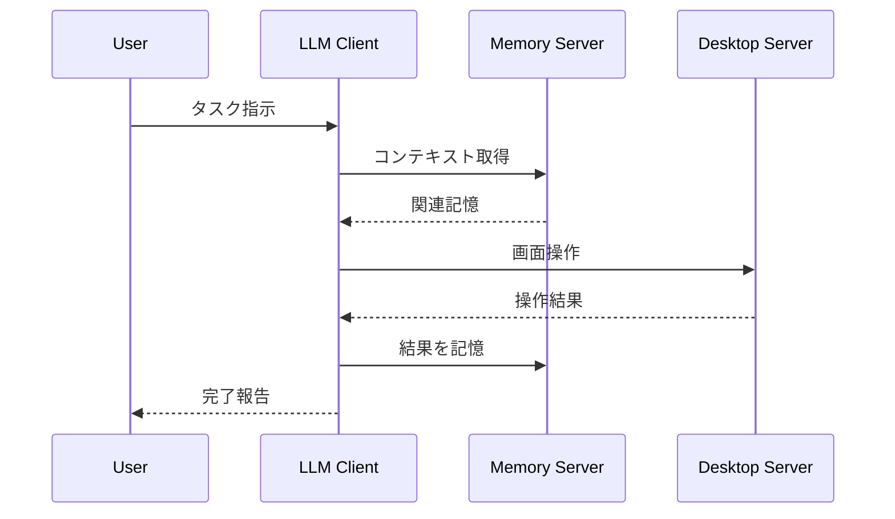

# JARVIS Architecture

## 設計原則

1. **Desktop First:** 全ての操作はGUIを通じて行う。ターミナルもエディタも「画面上のアプリ」として操作
2. **クライアント非依存:** LLMクライアントは交換可能。コスト・性能に応じて選択
3. **既存資産活用:** 車輪の再発明を避け、既存のMCPサーバーを積極的に活用

## システム構成

```
┌─────────────────────────────────────────────────────────┐
│                    LLM Clients                          │
│  ┌─────────────┐ ┌─────────────┐ ┌─────────────┐       │
│  │   Claude    │ │  VS Code /  │ │  Local LLM  │       │
│  │   Desktop   │ │   Cursor    │ │ (Mac Studio)│       │
│  └──────┬──────┘ └──────┬──────┘ └──────┬──────┘       │
└─────────┼───────────────┼───────────────┼───────────────┘
          │               │               │
          └───────────────┼───────────────┘
                          │
              ┌───────────▼───────────┐
              │   MCP (JSON-RPC)      │
              │   stdio transport     │
              └───────────┬───────────┘
                          │
┌─────────────────────────┼─────────────────────────────┐
│                   MCP Servers                          │
│  ┌──────────────────────┼──────────────────────────┐  │
│  │                      │                          │  │
│  │  ┌─────────────┐ ┌───┴───────┐                  │  │
│  │  │   Memory    │ │  Desktop  │                  │  │
│  │  │  (既存活用)  │ │   (自作)  │                  │  │
│  │  └──────┬──────┘ └─────┬─────┘                  │  │
│  │         │              │                        │  │
│  │    ┌────▼────┐    ┌────▼────┐                   │  │
│  │    │Vector DB│    │  macOS  │                   │  │
│  │    │         │    │Automation│                  │  │
│  │    └─────────┘    └─────────┘                   │  │
│  └─────────────────────────────────────────────────┘  │
└────────────────────────────────────────────────────────┘
```

## MCP Servers

### Desktop Server (自作)

**リポジトリ:** [mcp-desktop-server](https://github.com/tomoharu-hayashi/mcp-desktop-server)

JARVISの「手足」。GUIアプリケーションの自律操作を担当。

**責務:**

- 画面キャプチャ・解析（Vision）
- マウス・キーボード入力
- アプリケーション状態の認識

**技術:**

- pyautogui / macOS Accessibility API
- OCR / Vision LLM

### Memory Server (既存活用)

**状態:** 後回し（Desktop操作の安定化を優先）

JARVISの「記憶」。長期記憶と文脈理解を担当。

**候補:**

- [mem0](https://github.com/mem0ai/mem0) - Memory layer for AI
- その他MCP対応メモリサーバー

---

## Agent to Agent (A2A) Protocol

**状態:** 調査中

### 概要

GoogleがLinux Foundation傘下で開発するエージェント間通信プロトコル。
MCPが「ツールとの通信」を担うのに対し、A2Aは「エージェント同士の通信」を担う。

| 項目 | MCP | A2A |
|------|-----|-----|
| 目的 | LLM ↔ Tool | Agent ↔ Agent |
| 通信 | stdio / SSE | HTTP(S) / SSE |
| 発見 | 設定ファイル | Agent Card |

### Gemini CLIとの統合

**現状: 直接サポートなし**

Gemini CLIはMCPサーバーのみをネイティブサポート。A2Aエージェントを使うには：

1. **A2A→MCPブリッジを構築** - A2AエージェントをMCPツールとしてラップ
2. **別プロセスでホスト** - A2Aサーバーを別途起動し、MCPツール経由で呼び出し

### 参考リポジトリ

- [a2aproject/A2A](https://github.com/a2aproject/A2A) - プロトコル仕様
- [a2aproject/a2a-samples](https://github.com/a2aproject/a2a-samples) - サンプル実装
- [a2aproject/a2a-python](https://github.com/a2aproject/a2a-python) - Python SDK

### 結論

現時点でJARVISに導入するメリットは薄い。理由：

- Gemini CLIが直接サポートしていない
- Desktop MCPで単一エージェントとして完結している
- マルチエージェント構成が必要になったら再検討

## データフロー



## 設計判断

### なぜEngineering Serverを作らないか

- ターミナルもエディタもGUIアプリケーション
- Desktop Serverで統一的に操作可能
- 専用サーバーを作ると複雑性が増す
- 既存のCursor/VS Codeが十分に高機能

## 今後の拡張

- **Memory Server選定:** 既存ライブラリの調査・評価
- **Multi-Agent:** 複数エージェントの協調
- **Self-Improvement:** 自己改善ループ
