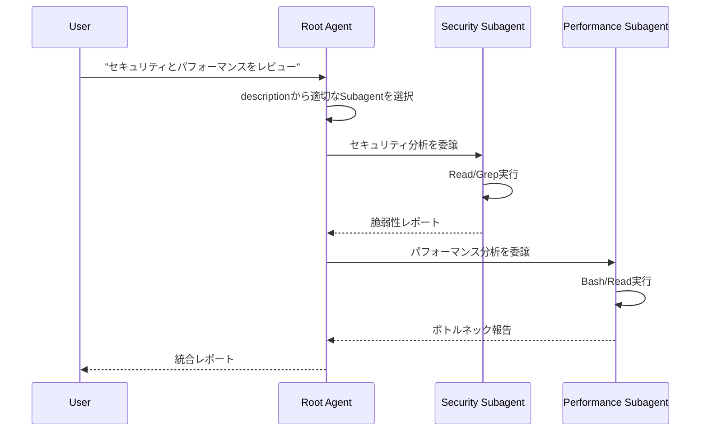

# Claude Code Subagent System Research

> **調査日**: 2025-12-03  
> **目的**: JARVISのRoot Agent / Child Agent設計の参考資料

## Overview

Claude Code Subagent Systemは、Anthropic社が提供する**エージェント階層化・委譲機構**。  
単一のRoot Agentが複数の専門化されたSubagentを定義・召喚し、タスクを委譲する。

### 核心思想

```
人間
  │
  └─→ Root Agent (汎用)
       ├─→ Subagent A (セキュリティ専門)
       ├─→ Subagent B (パフォーマンス分析)
       └─→ Subagent C (テスト生成)
```

**JARVISの理想形と一致**: 抽象的目標を保持するRoot → 具体的実行を委譲するChild

## Core Concepts

### 1. Subagent Definition (2つの方法)

#### A. Programmatic (推奨 - SDK使用時)

```typescript
const response = query({
  prompt: "タスク内容",
  options: {
    agents: {
      "security-reviewer": {
        description: "セキュリティ監査の専門家。脆弱性分析に使用",
        prompt: "あなたはセキュリティ専門家です。OWASP基準で...",
        tools: ["Read", "Grep", "Glob", "Bash"],
        model: "sonnet"
      },
      "performance-analyst": {
        description: "パフォーマンス最適化の専門家",
        prompt: "ボトルネック、メモリリーク、最適化を分析...",
        tools: ["Read", "Grep", "Bash"],
        model: "sonnet"
      }
    }
  }
});
```

#### B. Filesystem-Based (設定ファイル)

```markdown
<!-- .claude/agents/code-reviewer.md -->
---
name: code-reviewer
description: コード品質とセキュリティのレビュー専門家
tools: Read, Grep, Glob, Bash
model: sonnet
---

# System Prompt
あなたはシニアアーキテクトです。
- SOLID原則に基づくコード評価
- 技術的負債の特定
- リファクタリング提案
```

**設置場所**:

- `.claude/agents/*.md` - プロジェクト固有
- `~/.claude/agents/*.md` - 全プロジェクト共通

### 2. Subagent Properties

| Property | 説明 | 必須 |
|----------|------|------|
| `description` | いつ使うかの自然言語説明 (Root Agentが判断材料に使用) | ✓ |
| `prompt` | System Prompt (役割・専門性の定義) | ✓ |
| `tools` | 使用可能ツール配列。省略時は全ツール継承 | - |
| `model` | モデル指定 (`sonnet`/`opus`/`haiku`/`inherit`) | - |

### 3. Delegation Flow



### 4. Session Management

#### Resume (継続)

```typescript
// セッション開始
const initialResponse = query({
  prompt: "REST API構築",
  options: { model: "sonnet" }
});

let sessionId;
for await (const message of initialResponse) {
  if (message.type === 'system' && message.subtype === 'init') {
    sessionId = message.session_id;
  }
}

// セッション再開
const resumedResponse = query({
  prompt: "レート制限を追加",
  options: {
    resume: sessionId  // 同一セッションで継続
  }
});
```

#### Fork (分岐)

```typescript
// 別アプローチを探索 (元セッションは保持)
const forkedResponse = query({
  prompt: "実はGraphQL APIにしたい",
  options: {
    resume: sessionId,
    forkSession: true  // 新しいブランチ作成
  }
});
```

**用途**:

- 複数アプローチの並行検証
- オリジナルを維持した実験
- 会話履歴の分岐管理

## Architecture Patterns

### 1. DevOps Automation Example

```typescript
async function runDevOpsAgent(task: string) {
  const response = query({
    prompt: task,
    options: {
      systemPrompt: "DevOps自動化のエキスパート...",
      
      // カスタムツール (MCP Server経由)
      mcpServers: {
        "app-services": appTools
      },
      
      // 専門Subagent群
      agents: {
        "deployment-agent": {
          description: "デプロイとロールバック担当",
          prompt: "テスト確認→Staging→本番の順で...",
          tools: ["Bash", "Read", "mcp__app-services__log_event"],
          model: "sonnet"
        },
        "incident-responder": {
          description: "インシデント対応担当",
          prompt: "影響評価→原因特定→修正→状況報告",
          tools: ["Bash", "Read", "Grep", "mcp__app-services__send_notification"],
          model: "sonnet"
        },
        "monitoring-agent": {
          description: "システム監視担当",
          prompt: "メトリクス確認→傾向分析→異常検知→アラート",
          tools: ["Bash", "Read", "mcp__app-services__log_event"],
          model: "haiku"  // 軽量モデルで高頻度実行
        }
      },
      
      // Permission制御
      canUseTool: async (toolName, input) => {
        // 破壊的コマンドをブロック
        if (toolName === 'Bash') {
          const dangerous = ['rm -rf', 'dd if=', 'mkfs'];
          if (dangerous.some(p => input.command.includes(p))) {
            return { behavior: "deny", message: "危険なコマンド" };
          }
        }
        
        // デプロイは確認
        if (input.command?.includes('deploy')) {
          return { behavior: "ask", message: "本番デプロイしますか?" };
        }
        
        return { behavior: "allow" };
      }
    }
  });
  
  // ストリーミング処理
  for await (const message of response) {
    switch (message.type) {
      case 'system':
        if (message.subtype === 'subagent_start') {
          console.log(`🚀 Subagent起動: ${message.agent_name}`);
        }
        break;
      case 'assistant':
        console.log(message.content);
        break;
      case 'tool_call':
        console.log(`⚙️ ツール実行: ${message.tool_name}`);
        break;
    }
  }
}
```

### 2. Code Review Pipeline

```typescript
const response = query({
  prompt: "アプリケーション全体をレビュー",
  options: {
    agents: {
      "security-reviewer": {
        description: "セキュリティ監査専門",
        prompt: "認証/認可、SQLインジェクション、XSS、依存関係、API脆弱性を重点的に...",
        tools: ["Read", "Grep", "Glob"],
        model: "sonnet"
      },
      "performance-analyst": {
        description: "パフォーマンス最適化専門",
        prompt: "アルゴリズム複雑度、メモリ使用、DB最適化、キャッシュ戦略を分析...",
        tools: ["Read", "Grep", "Bash"],
        model: "sonnet"
      },
      "test-analyst": {
        description: "テストカバレッジ専門",
        prompt: "テスト網羅性、エッジケース、統合テスト、モック使用を評価...",
        tools: ["Read", "Grep", "Write"],
        model: "haiku"
      },
      "code-reviewer": {
        description: "コード品質専門",
        prompt: "SOLID原則、デザインパターン、技術的負債を評価...",
        tools: ["Read", "Edit", "Write"],
        model: "sonnet"
      }
    }
  }
});

// Root Agentが自動的に適切なSubagentを召喚・統合
```

## Production Deployment Patterns

### Pattern 1: Ephemeral Sessions

```
[User Task] → [New Container] → [Agent実行] → [Container破棄]
```

**用途**: バグ修正、請求書処理、翻訳、画像処理など単発タスク

### Pattern 2: Long-Running Sessions

```
[Container常駐] → [複数Agent同時実行] → [需要に応じスケール]
```

**用途**: メールエージェント、サイトビルダー、高頻度チャットボット

### Pattern 3: Hybrid Sessions

```
[Ephemeral Container] ← [DB/Session復元] → [タスク完了で停止] → [再開可能]
```

**用途**: プロジェクトマネージャー、調査タスク、カスタマーサポート

### Pattern 4: Single Container (Multi-Agent)

```
[1つのContainer] 内で [複数Agent協調実行]
```

**用途**: ゲームシミュレーション、エージェント相互作用が必要な場合

## Custom Tools (MCP Integration)

### In-Process SDK MCP Server

```typescript
import { createSdkMcpServer, tool } from "@anthropic-ai/claude-agent-sdk";
import { z } from "zod";

const weatherServer = createSdkMcpServer({
  name: "weather-service",
  version: "1.0.0",
  tools: [
    tool(
      "get_weather",
      "指定地点の現在の天気を取得",
      {
        location: z.string().describe("都市名または座標"),
        units: z.enum(["celsius", "fahrenheit"]).default("celsius")
      },
      async (args) => {
        const response = await fetch(`https://api.weather.com/v1/current?...`);
        const data = await response.json();
        return {
          content: [{
            type: "text",
            text: `気温: ${data.temp}° ${args.units}\n湿度: ${data.humidity}%`
          }]
        };
      }
    )
  ]
});

// Agentで使用
const response = query({
  prompt: "サンフランシスコの天気は?",
  options: {
    mcpServers: { "weather-service": weatherServer },
    allowedTools: ["mcp__weather-service__get_weather"]
  }
});
```

**利点**:

- サブプロセス不要 (同一プロセス内実行)
- IPC不要で高速
- デプロイ簡単 (単一プロセス)
- デバッグ容易
- Type-safe

### External MCP Server (Subprocess)

```typescript
const response = query({
  prompt: "ファイル一覧とコードベース分析",
  options: {
    mcpServers: {
      "filesystem": {
        command: "npx",
        args: ["@modelcontextprotocol/server-filesystem"],
        env: { ALLOWED_PATHS: "/Users/dev/projects" }
      },
      "git": {
        command: "npx",
        args: ["@modelcontextprotocol/server-git"],
        env: { GIT_REPO_PATH: "/Users/dev/projects/repo" }
      }
    }
  }
});
```

## Python SDK Example

### Hooks (PreToolUse / PostToolUse)

```python
from claude_agent_sdk import (
    ClaudeAgentOptions,
    ClaudeSDKClient,
    HookMatcher
)

async def check_bash_command(input_data, tool_use_id, context):
    """破壊的コマンドをブロック"""
    tool_name = input_data["tool_name"]
    tool_input = input_data["tool_input"]
    
    if tool_name != "Bash":
        return {}
    
    command = tool_input.get("command", "")
    dangerous = ["rm -rf", "sudo", "foo.sh"]
    
    for pattern in dangerous:
        if pattern in command:
            return {
                "hookSpecificOutput": {
                    "hookEventName": "PreToolUse",
                    "permissionDecision": "deny",
                    "permissionDecisionReason": f"危険なパターン: {pattern}"
                }
            }
    return {}

options = ClaudeAgentOptions(
    allowed_tools=["Bash"],
    hooks={
        "PreToolUse": [
            HookMatcher(matcher="Bash", hooks=[check_bash_command])
        ]
    }
)

async with ClaudeSDKClient(options=options) as client:
    await client.query("Run: ./foo.sh --help")  # ブロックされる
    await client.query("Run: echo 'Hello'")     # 実行される
```

### Stateful Tools

```python
from claude_agent_sdk import tool, create_sdk_mcp_server

class DataStore:
    def __init__(self):
        self.items = []
        self.counter = 0

store = DataStore()

@tool("add_item", "アイテムを追加", {"item": str})
async def add_item(args):
    store.items.append(args["item"])
    store.counter += 1
    return {
        "content": [{
            "type": "text",
            "text": f"追加: '{args['item']}'. 合計: {store.counter}"
        }]
    }

@tool("list_items", "全アイテムを表示", {})
async def list_items(args):
    if not store.items:
        return {"content": [{"type": "text", "text": "空"}]}
    items_text = "\n".join(f"- {item}" for item in store.items)
    return {"content": [{"type": "text", "text": f"アイテム:\n{items_text}"}]}

server = create_sdk_mcp_server("store", tools=[add_item, list_items])
options = ClaudeAgentOptions(
    mcp_servers={"store": server},
    allowed_tools=["mcp__store__add_item", "mcp__store__list_items"]
)

async with ClaudeSDKClient(options=options) as client:
    await client.query("'apple'と'banana'を追加して一覧表示")
```

## Benefits of Subagents

### 1. Specialized Instructions

各Subagentが特化したSystem Promptを持つ → Root Agentのプロンプトが肥大化しない

**例**: `database-migration` Subagentは「SQL最適化、ロールバック戦略、データ整合性」の専門知識を保持。  
Root Agentには不要なノイズを排除。

### 2. Focused Tools

Subagent毎に必要最小限のツールのみ許可 → セキュリティ向上・実行効率化

**例**:

- Security Reviewer: `Read`, `Grep` のみ (書き込み禁止)
- Code Editor: `Edit`, `Write` も許可

### 3. Model Selection

タスクの重要度・複雑度に応じてモデル選択

- 重要タスク: `sonnet` (高性能)
- 高頻度/軽量タスク: `haiku` (コスト削減)

### 4. Clear Separation of Concerns

責務の明確化 → 保守性・拡張性向上

```
Root: タスク分割・統合
 ├ Security: 脆弱性検出
 ├ Performance: ボトルネック分析
 └ Testing: テスト生成
```

### 5. Parallel Execution (将来)

複数Subagentの並行実行でスループット向上 (現在は未実装だが設計上可能)

## Permission Control

### 3つのモード

```typescript
// 1. acceptEdits - 自動承認 (ファイル編集を全て許可)
permissionMode: "acceptEdits"

// 2. default - 標準チェック (危険な操作は確認)
permissionMode: "default"

// 3. bypassPermissions - 全てスキップ (危険・本番非推奨)
permissionMode: "bypassPermissions"
```

### 高度な制御: `canUseTool` Callback

```typescript
canUseTool: async (toolName, input) => {
  // 読取専用操作は許可
  if (['Read', 'Grep', 'Glob'].includes(toolName)) {
    return { behavior: "allow" };
  }
  
  // 破壊的コマンドは拒否
  if (toolName === 'Bash' && 
      (input.command.includes('rm ') || input.command.includes('delete'))) {
    return { 
      behavior: "deny", 
      message: "破壊的操作は手動承認が必要" 
    };
  }
  
  // ファイル書き込みは確認
  if (toolName === 'Write' || toolName === 'Edit') {
    return { 
      behavior: "ask", 
      message: `${input.file_path}を変更しますか?` 
    };
  }
  
  return { behavior: "allow" };
}
```

## Settings Management

### 3つのソース

```typescript
// 全設定読込 (user, project, local)
settingSources: ["user", "project", "local"]

// プロジェクト設定のみ (CI/CD推奨)
settingSources: ["project"]

// 完全分離 (サンドボックス)
settingSources: []
```

**設定ファイル**:

- `~/.claude/settings.json` - user
- `.claude/settings.json` - project
- `.claude/local/settings.json` - local (gitignore推奨)

## JARVISへの応用

### 1. Architecture Mapping

| Claude Code | JARVIS相当 |
|-------------|------------|
| Root Agent | Root Agent (Gemini CLI) |
| Subagent | Child Agent (spawn) |
| `description` | Agent選択のメタ情報 |
| `prompt` | 専門性の定義 |
| `tools` | 権限制限 |
| Session | Context保持機構 |
| Fork | 並行実験・分岐探索 |

### 2. 設計方針の一致点

✓ **階層化**: Root → Childの明確な委譲  
✓ **専門化**: 各Agentが特化した役割  
✓ **自律性**: Child Agentが独立して判断・実行  
✓ **要約**: Root Agentは要約のみ受け取る (Subagentの詳細は隠蔽)  
✓ **停止権**: Root Agentが全Child停止可能 (Permission制御相当)

### 3. JARVIS固有の拡張要件

| 要件 | Claude Code | JARVIS実装 |
|------|-------------|----------------|
| **タスク管理** | デフォルトタスク機能 | GitHub Projectsで永続化 |
| **永続化** | Compact (セッション) | Compact + GitHub Projects |
| **長期記憶** | - | Brain Server |
| **自浄作用** | Subagent要約 | Brain + Compact |
| **PC操作** | Terminal tools | Desktop MCP (将来) |

### 4. 実装ロードマップ

#### Phase 1: Claude Code統合

- [x] MCP Serverの自作 (Desktop, Brain)
- [x] Claude Code Subagent採用決定
- [ ] `.claude/agents/*.md` 定義
- [ ] `.claude/settings.json` Hooks設定
- [ ] GitHub Projects連携（タスク永続化）

#### Phase 2: Brain Server強化

- [ ] N-hop検索の精度向上
- [ ] 忘却アルゴリズム
- [ ] 優先度スコアリング

#### Phase 3: 高度な自律性

- [ ] 自己モニタリング（メタ認知）
- [ ] Desktop MCP統合（全PC操作）

## Key Takeaways

### 1. Programmatic Definitionが強力

ファイルシステムベースよりSDK経由の動的定義が柔軟。  
JARVISでは実行時にAgent定義を生成・変更可能にすべき。

### 2. Session Management = Context管理

Resume/Forkはコンテキスト管理そのもの。  
JARVISの「自浄作用」に直結する機能。

### 3. Permission Controlは必須

Root AgentがChild Agentを制御する仕組み = `canUseTool`  
JARVISではより高度な制御 (予算、時間、リスク) を追加。

### 4. MCP = ツール拡張の標準

In-ProcessとExternal Serverの使い分けが重要。  
JARVISでは高速性重視でIn-Process MCPを基本とする。

### 5. 要約の重要性

Root AgentはSubagentの詳細を知らない (descriptionのみで判断)。  
JARVISでは「抽象化」として強化すべき要素。

## References

- [Claude Agent SDK (TypeScript)](https://github.com/anthropics/claude-agent-sdk-typescript)
- [Claude Agent SDK (Python)](https://github.com/anthropics/claude-agent-sdk-python)
- [Claude Agent SDK Documentation](https://platform.claude.com/docs/agent-sdk)
- [Model Context Protocol](https://modelcontextprotocol.io)

---

**Next Steps**:

1. `.claude/agents/*.md` にSubagent定義を作成
2. `.claude/settings.json` でHooks設定
3. GitHub Projects連携フローの設計
